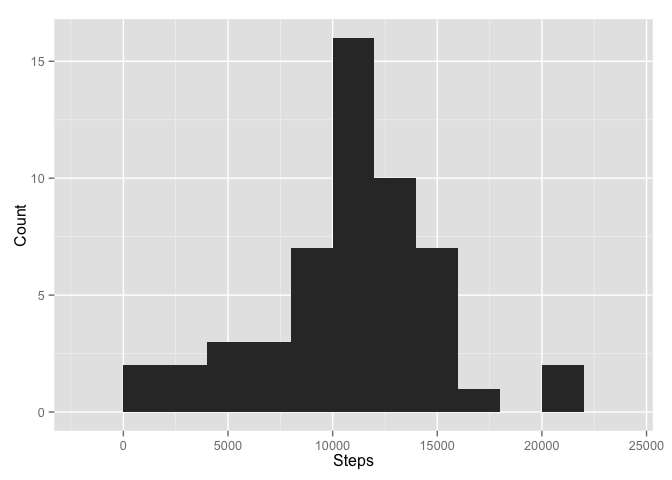

# Reproducible Research: Peer Assessment 1


## Loading and preprocessing the data

```r
suppressPackageStartupMessages(library(dplyr))
suppressPackageStartupMessages(library(ggplot2))
suppressPackageStartupMessages(library(lubridate))
activity <- unz("activity.zip", "activity.csv") %>%
    read.csv() %>%          #Read data from .csv file
    tbl_df()                #Wrap data frame for easy processing
activity$date <- ymd(activity$date)     #Convert date factors into time class
```

## What is mean total number of steps taken per day?
To calculate these stats use the following code, which groups the data by date and then finds the total number of steps in a given day, subsequently calculating the mean and median:

```r
activity <- group_by(activity, date)    #Group by date for easy daily stats
dailyActivity <- summarise(activity, daysteps=sum(steps))
activity <- ungroup(activity)           #Ungroup for further processing
dailyMean <- mean(dailyActivity$daysteps, na.rm=TRUE)
dailyMedian <- median(dailyActivity$daysteps, na.rm=TRUE)
```
The mean total number of steps taken per day is around 10766.19, while the mean is 10765. Here is the histogram of the total number of steps taken per day:


```r
ggplot(dailyActivity, aes(daysteps)) + geom_histogram(binwidth = 1000) + 
    labs(x = "Steps") + labs(y = "Count")
```

 

## What is the average daily activity pattern?
To get the activity pattern the data is re-grouped by interval and then the average number of steps in a given interval is found as well as the interval with the largest number of steps.  

```r
activity <- group_by(activity, interval)    #Group by date for easy daily stats
intervalActivity <- summarise(activity, meanInterval=mean(steps, na.rm=TRUE))
maxStepInterval <- intervalActivity$interval[which.max(intervalActivity$meanInterval)]
activity <- ungroup(activity)           #Ungroup for further processing
```
  
  
Here is the line graph of the daily activity data:

```r
ggplot(intervalActivity, aes(interval, meanInterval)) + geom_line() + 
    labs(x = "Interval") + labs(y = "Average # of steps in interval") +
    geom_vline(xintercept = maxStepInterval, colour="red")
```

 

The red vertial line shows that the interval with the highest average activity is the interval number 835.  

## Imputing missing values

```r
missing <- sum(is.na(activity$steps))
```
The total number of missing values in the dataset is 2304.

Substitute missing values with averages for a given interval and store in a new variable.


## Are there differences in activity patterns between weekdays and weekends?
